More than 80% of all Fortune 100 companies trust, and use **Kafka**.
Apache Kafka is an **open-source distributed event streaming platform** used by thousands of companies for **high-performance** data pipelines, streaming analytics, data
integration, and mission-critical applications.

# 开始
## 简介
### 引言

### <font color=red>What</font>-->何为事件流?
事件流(**Event Streming**)是"数字化"的人体中枢神经系统. 是商业业务日益软件化和自动化的切持续不断运作的现实世界技术基础. 
从技术上来说,事件流是以流式事件的方式从事件源(如数据库, 传感器, 移动设备, 云服务,软件应用等)即时获取,存储,操作数据,然后处理并且即时响应给其他事件流的最佳实践. 因此, 事件流是数据流得以持续翻译和信息能够在对的时间出现在对的位置的保障.


### <font color=red>Where</font>-->事件流用在何处?
事件流在各行各业都有则广泛的应用, 如下:

<ul>
<li>在股票, 银行,保险等行业即时处理转账和交易数据</li>
<li>在物流和自动化产业跟踪监控车辆,船舰等的实时数据</li>
<li>在工厂持续从IoT设备获取并分析数据</li>
<li>在零售,酒店,旅游业以及移动应用场景中, 采集并立即响应顾客的数据请求</li>
<li>在医疗领域, 持续监控病人的健康数据并做出高效准确的预测以尽早寻求追加治疗方案</li>
<li>连接并存储同一公司不同业务分支的数据并确保其可用性</li>
<li>充当数据平台, 事件驱动架构, 微服务 等应用场景的基石.</li>
</ul>

### <font color=red>Why</font>-->Kafka如何支撑业务数据?
 kafka具有如下三种能力以确保任何想要在业务场景中实现端对端的事件流处理的用户能够应用一种经过实战检验的方式实现自己的业务:
<ol>
<li>发布和订阅事件流, 即: 持续写入数据到外部系统/读取外部系统该数据</li>
<li>按业务需求和用户意愿持久,可靠地存储事件流</li>
<li>在事件流到达的即刻处理事件流数据(也可以是回溯的方式)</li>
</ol>

所有以上功能在分布式, 高扩展, 弹性, 容错的环境中都是得以保障的. Kafka能部署在物理机, 虚拟机, 容器,本地应用和云应用中. 用户可以根据自身需要和业务场景选择自行管理或者是托管服务(由供应商提供)来管理自己的Kafka环境.

### How-->Kafka是如何运作的? 
 Kafka是一个由客户端和服务端组成的分布式系统. 这些服务端和客户端之间通过高效的TCP网络协议进行通信. 他能被能部署在物理机, 虚拟机, 容器,本地应用和云应用中.</br>

**服务端:**  Kafka集群能运行在由多个数据中心或云基站的环境中. 这些被称之为(**broker**)服务器组成了数据存储层. 另外一部分服务器负责运行Kafka连接器持续从事件流导入/导出数据以与其他系统(数据库或其他Kafka集群)进行整合. 同时, 为了方便用户实现关键用例, Kafka
 还提供了易扩展和高容错的性能特点. 如果急群众某一个节点宕机, 集群中其他节点会接管该节点的工作以持续保证数据不会丢失.

**客户端:**  客户端保证用户能往那些读/写以及并行处理事件流的分布式应用或微服务中写入数据, 即使是在网络瘫痪或硬件故障的情况下.Kafka提供了大量的客户端API库, 其中对Java和Scala语言支持的最好.  

### Terminologies 

<font color=red>**1. Event**</font>: Event(事件,也被称之为:消息或记录) 记录了现实世界的业务数据信息.  当你往Kafka写入数据时, 其实是在往Kafka提交事件记录. 理论上, 事件有一个key, 一个value值和一个时间戳以及一些(非必须的)元数据头(metadata headers). 如:
     
     ```markdown
     
        Event key: "Alice"
        Event value: "Made a payment of $200 to Bob"
        Event timestamp: "Jun. 25, 2020 at 2:06 p.m."
     ```

<font color=red>**2. 生产者**</font>: 发布事件到Kafka集群的客户端应用.

<font color=red>**3. 消费者**</font>: 从Kafka集群订阅事件消费的客户端应用.

<font color=red>**4. 主题**</font>: 事件被组织并存储在主题中. 可以形象的将主题理解为PC的文件夹, 而事件则是文件夹中的具体的文件.

<font color=red>**5. 分区**</font>: 一个主题被分布在一系列不同broker中. 这种分布式的分区的设计使得客户端同时从多台broker读取/写入数据成为可能.当一个新的事件被发布到某个主题时, 该事件实际上是被追加到该主题的某一个分区上的. 拥有相同key的事件会被写到相同的分区. 同时,kafka
也保证了指定主题分区的消费者会按照事件被写入改分区的顺序取读取该分区的事件.
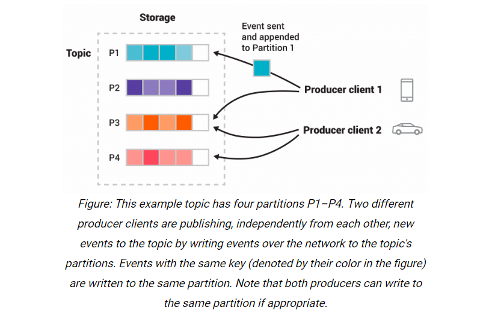

如上图, 一种颜色代表了一个分区, 消费者A: 手机 和消费者B: 小车 分别向主题: T的分区(P1,P3)和(P3,P4)发布消息. 
注意: a). 相同key(颜色表示)的事件会被写入同一个分区.
     b). 不同的生产者可以往同一个主题的同一个分区写数据.   
     
<font color=red>**6. 副本**</font>:  同一份数据会被存储到不同的机器(broker),每一份被称为一个副本, 副本是容错和高可用性的基础. This replication is performed at the level of topic-partitions. 即: 副本的粒度到主题-分区.

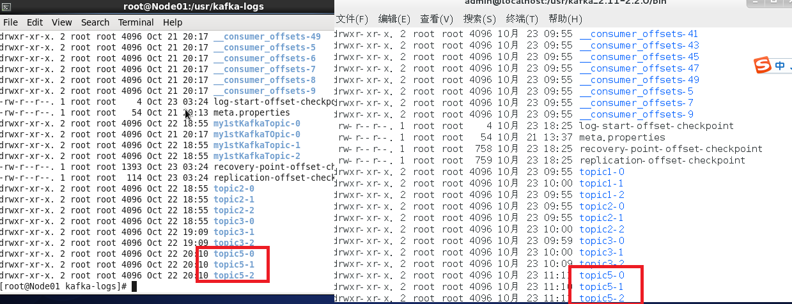


 Kafka中生产者和消费者是完全解耦的, 该设计保证了高扩展性. 例如, 生产者永远不必等待消费者, 事件会被处理有且一次(exactly-once).

## 用例
### 消息代理
Kafka作为传统消息代理的替代品有着出色的表现. 拥有更高的吞吐量的同时也兼具内置分区, 副本机制,容错以及易扩展,低延时等高级特性. 因此, kafka丝毫不逊色于ActiveMQ和RabbitMQ. 
### 网页动态跟踪    
Kafka最早被应用于网页活动的跟踪监控. 这也就意味着诸如页面浏览, 搜索等网页活动被按照特定规律发布到特定主题. 后续会被HDFS或者离线数据仓库订阅消费.
### 日志整合
很多人会将Kafka用作日志整合的解决方案. 典型的日志整合流程是从物理服务器采集日志文件然后放到文件服务器或者HDFS中以供后续处理. Kafka抽取出日志文件的细节并将其抽象成一个更简洁的消息流. 这也就保障了低延时和分布式数据消费.  

 **Kafka还可以用于流处理, 事件溯源, 提交日志记录等场景, 此处不做详细讨论, 可参考[官网](http://kafka.apache.org/documentation/#introduction).**

## 快速入门
Kafka是java语言开发的, 运行需要JDK支持. 而作为服务监控,同时也需要zookeeper的支持. 
下面对集群搭建流程做详细解释.

### Step 1 关闭防火墙
   关闭Linux防火墙. 然后检查确认是否已关闭成功.
```shell script
service iptables stop   # 关闭防火墙
service iptables status # 查看服务状态
chkconfig iptables off  #停用开机自启动防火墙服务
chkconfig --list        # 检查
```
**注意: CentOS系统版本不同, 关闭防火墙的命令也不一样.**
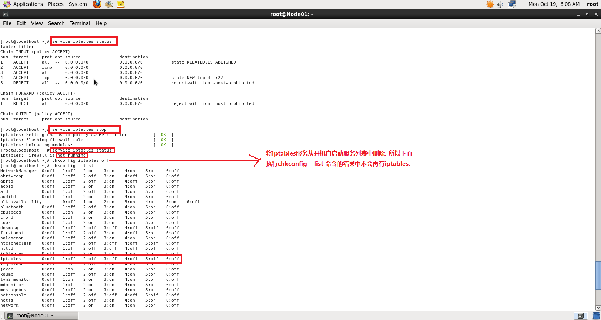
    
### Step 2 配置域名解析
执行:
```shell script
vim /etc/hosts    
```
修改hosts文件, 为所有集群节点添加IP和HOSTNAME<br/>
192.168.210.140 Node01 <br/>
192.168.210.141 Node02 <br/>
192.168.210.143 Node03 <br/>

执行:
```shell script
vim /etc/sysconfig/network
```
分别为各个节点添加<br/>
NETWORKING=yes  <br/>
HOSTNAME=Node01<br/>
最终结果如下图:<br/>

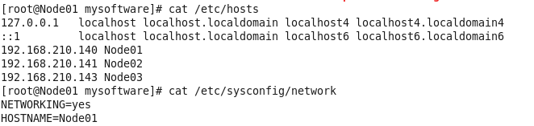

然后执行
```shell script
reboot
```
重启系统, 让上述配置文件重新生效.

### Step 3 JDK配置
解压JDK rpm文件到指定目录
```shell script
rpm -ivh jdk-8u261-linux-x64.rpm /usr/ -C 
```
编辑配置文件 
```shell script
vim ~/.bashrc
```
在最后追加
```shell script
JAVA_HOME=/usr/java/latest
PATH=$PATH:$JAVA_HOME/bin
CLASSPATH=.
export JAVA_HOME
export PATH
export CLASSPATH
```
然后执行如下代码让配置文件生效
```shell script
source ~/.bashrc
```
然后执行下面代码检查JDK环境是否已配置成功
```shell script
java -version
echo $JAVA_HOME
```
检查结果如下图:
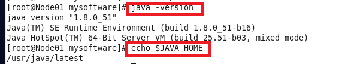

### Step 4 zookeeper配置
下载zookeeper 压缩包tar包, 上传到Linux,并执行如下代码解压到指定目录/usr/下:
```shell script
tar -zxf  zookeeper-3.4.6.tar.gz -C  /usr/ 
```
复制官方提供的配置文件, 
```shell script
cd /usr/zookeeper-3.4.6/conf/
cp zoo_sample.cfg  zk.cfg
```
然后编辑配置文件
```shell script
vim zk.cfg
```
按下图方式对配置文件做修改(zookeeper快照数据存储路径设置和集群服务器节点信息配置):
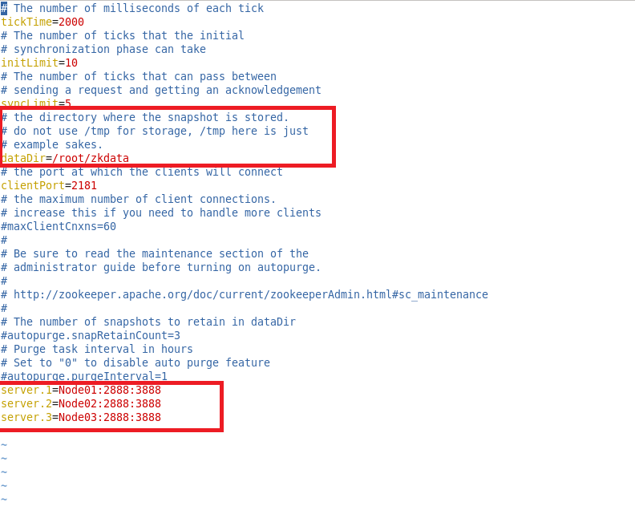
然后按刚才的修改创建zookeeper快照数据的存储目录:
```shell script
mkdir /root/zkdata
```
然后创建编辑myid文件
```shell script
vim /root/zkdata/myid
```
作如下修改: (id要与zk.cfg中配置的server.1=Node01:2888:3888中的server后面的序号一致)

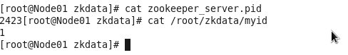

然后将zookeeper安装目录及其所有子目录,子文件拷贝到集群其他节点.
```shell script
scp -r /usr/zookeeper-3.4.6/  root@Node02:/usr
```
如果没做过**免密配置**, 则输入指定目标节点的root密码即可拷贝. 如果做过免密配置, 则会直接拷贝.<br/>
免密配置的具体配置流程及其原理解释可以参见如下博客.
[免密配置](https://www.cnblogs.com/wenxingxu/p/9597307.html)
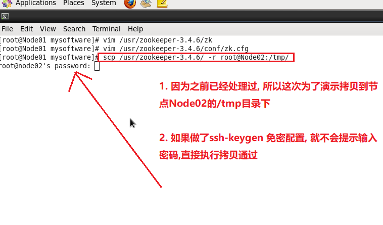    
此时在Node02节点的对应目录已经能看到拷贝过来的`zookeeper-3.4.6`目录. 同样的方法, 将目录也拷贝到Node03节点指定目录.<br/>
然后在Node02和Node03节点中执行如下命令,创建zookeeper的快照数据存储目录, 并添加myid文件
```shell script
cd /root
mkdir zkdata
vim zkdata/myid
```
至此. zookeeper集群配置也就完成. 继续启动所有集群节点的zookeeper服务
```shell script
cd /usr/zookeeper-3.4.6/bin/
./zkServer.sh start ../conf/zk.cfg  # 启动服务, ../conf/zk.cfg表示启动当前zookeeper服务要使用的配置文件
```
然后检测服务启动成功与否
```shell script
./zkServer.sh status ../conf/zk.cfg 
```
见到如下反馈信息说明已经启动成功. 


如果要关闭zookeeper服务可以执行:
```shell script
./zkServer.sh stop ../conf/zk.cfg 
```

### step 5 kafka集群搭建

解压
```shell script
tar -zxf kafka_2.11-2.2.0.tgz -C /usr/ 
```
修改配置文件
```shell script
vim /usr/kafka_2.11-2.2.0/config/server.properties
```
具体修改如下图中三个配置项:
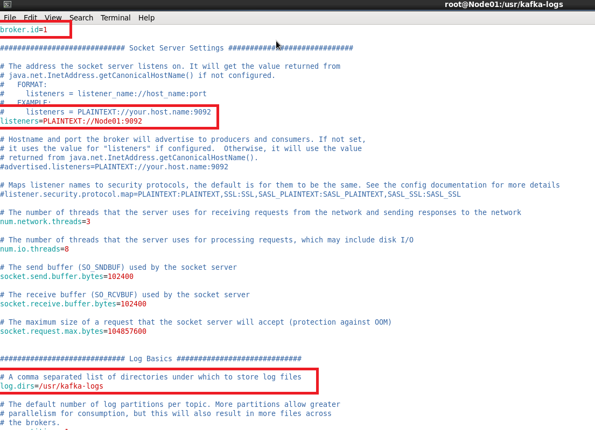
按照`server.properties`里配置的log.dirs配置项的值创建kafka日志目录
```shell script
cd /usr/
mkdir kafka-logs
```
然后就可以进入kafka的bin目录下查看脚本
```shell script
cd /usr/kafka_2.11-2.2.0/bin/
```
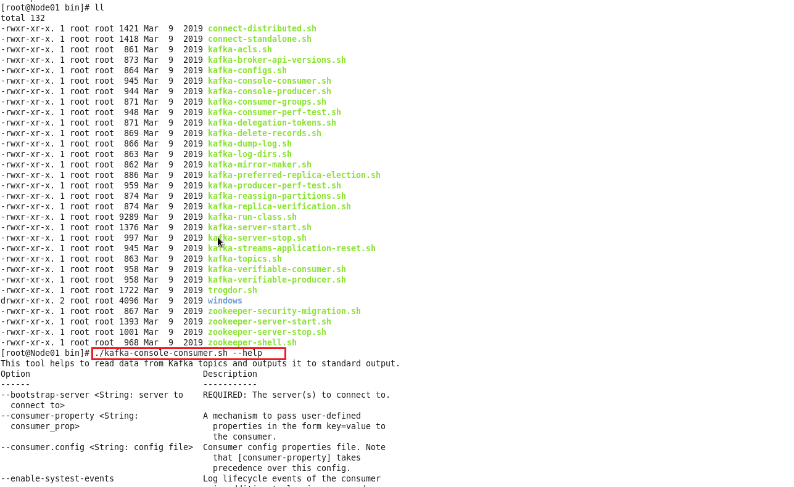
想查看具体脚本的使用方法可以执行--help, 如下:
```shell script
./kafka-console-consumer.sh --help
```
启动kafka服务端:
```shell script
./kafka-server-start.sh -daemon  ../config/server.properties # -daemon表示以守护/后台进程启动kafka服务, 敞口关闭进程也会继续. 后面则是指明具体的启动配置文件
```
检测是否启动成功:
```shell script
jps
```
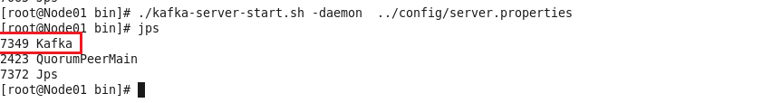
注意: 
`/usr/kafka_2.11-2.2.0/config/server.properties`里的broker.id的值要和当前节点的`/usr/kafka-logs/meta.properties`里的'broker.id'要保持一致. 否则kafka会在启动后秒退.

按照同样的方法配置集群中其他节点的kafka.


## Kafka-Eagle安装
确保ke.sh有可执行权限
```shell script
chmod u+x /usr/kafka-eagle-web-2.0.2/bin/ke.sh 
```


Linux系统安装MySQL步骤:
step1 : 
[MySQL官网](https://dev.mysql.com/downloads/mysql/)下载MySQL安装包:
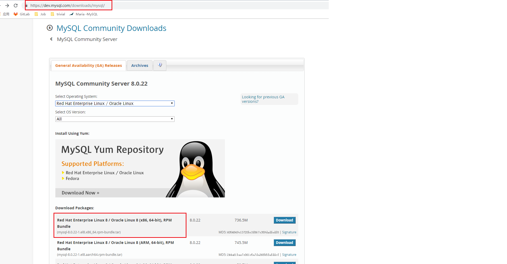

step2: 上传包
winscp(或其他) 软件上传到Linux指定目录下. (此处传到: /mysoftware/)  

step3: 解压
```shell script
cd /mysoftware
tar -xvf mysql-8.0.22-1.el8.x86_64.rpm-bundle.tar -C /usr/
```
step4: 查看解压文件
```shell script
ls -l /usr/
```
如图:
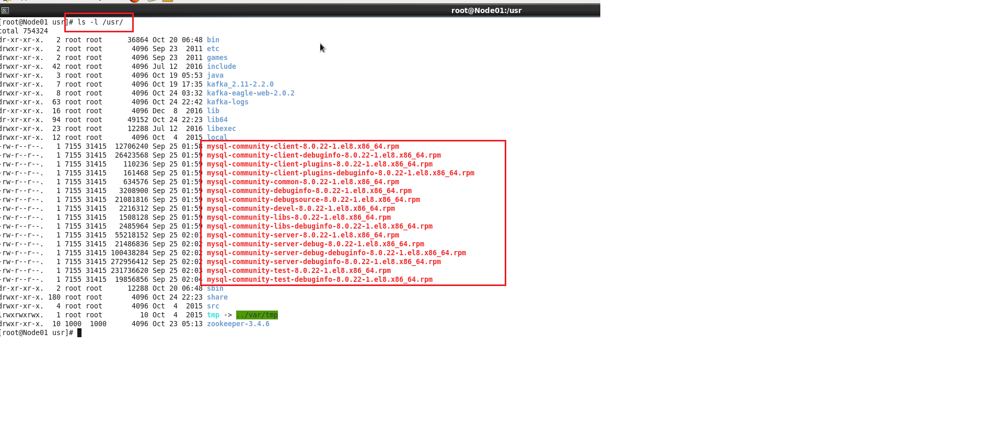

step5: 确认系统之前是否装过MySQL
```shell script
rpm -qa | grep mysql 
```
结果:

如果已经安装过mysql, 先卸载:
```shell script
rpm -e --nodeps mysql-libs-5.1.71-1.el6.x86_64
```
然后再次执行:
```shell script
rpm -qa | grep mysql 
```
如果没有任何输出, 说明卸载成功

step5 : 依次安装
```shell script
rpm -ivh 
```
**注：ivh中， i-install安装；v-verbose进度条；h-hash哈希校验**

安装成功提示:

监控首页
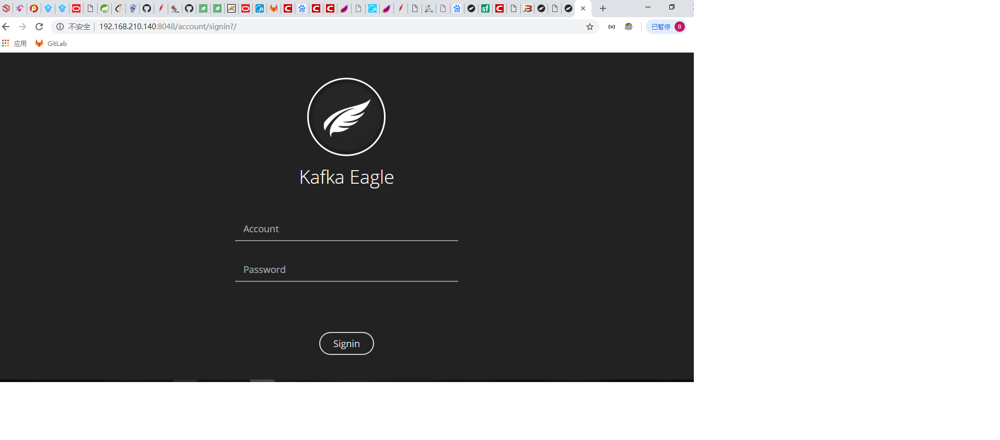


## 生态
## 升级
# APIs
## 生产者 API
## 消费者API
## 流 API
## 连接 API
## 管理员 API
## 高级API 
### Offset控制
#### ConsumerConfig.AUTO_OFFSET_RESET_CONFIG配置
在消费者consumerA首次订阅某主题消息topicB的时候, topicB是没有维护consumerA的offset信息的. 那么首次订阅该从什么offset位置开始消费呢? 该offset是有三种策略可选的:
<ol>
<li>latest: [默认]配置, 表示consumerA会从topicB的最新offset位置开始消费, 即从consumerA订阅topicB开始后, 新进入topicB的消息才会被consumerA消费. </li>
<li>earlist: 表示consumerA会从topicB的最开始的offset位置开始消费, 即包括consumerA订阅topicB之前的所有消息都会被消费</li>
<li>none: 如果没找到当前消费者组之前提交的offset值, 会向调用者(消费者)抛异常. </li>
</ol> 
值得注意的是: **offset**配置只会在消费者首次订阅消息的时候生效, 因为一旦开始订阅并消费消息后, 主题topicB 就会维护当前消费者consumerA 的消费的offsset信息, 下次再消费时会从维护的日志中获取consumerA的消费offset位置比如: O1,然后再继续从O1开始消费. 
该配置在JAVA API中由 `ConsumerConfig.AUTO_OFFSET_RESET_CONFIG` 配置项配置.


#### ConsumerConfig.AUTO_OFFSET_RESET_CONFIG 测试

为了检测上面的结论, 我们按照如下步骤进行测试:
step1: 首先新建一个主题topicA
```java
package main.core;

import org.apache.kafka.clients.admin.*;

import java.util.Arrays;
import java.util.Map;
import java.util.Properties;
import java.util.Set;
import java.util.concurrent.ExecutionException;

/**
 * created by Joshua.H.Brooks on 2020.10月.23.10.23
 */
public class topicManagement {
    private static  AdminClient adminClient;

    public static void main(String[] args) throws ExecutionException, InterruptedException {
        Properties properties = prepareEnvironment();
        adminClient = KafkaAdminClient.create(properties);
        createTopicByMe(adminClient,"topicA");
        listAllMyTopics(adminClient);
        adminClient.close();
    }

    private static void createTopicByMe(AdminClient adminClient,String topic2BCreated) throws ExecutionException, InterruptedException {
        CreateTopicsResult createTopicsResult =
                adminClient.createTopics(Arrays.asList(new NewTopic(topic2BCreated, 3, (short) 3)));
        createTopicsResult.all().get(); // 触发同步创建
    }

    private static void listAllMyTopics(AdminClient adminClient) throws ExecutionException, InterruptedException {
        ListTopicsResult listTopicsResult = adminClient.listTopics();
        Set<String> topicNames = listTopicsResult.names().get();
        StringBuilder stringBuilder = new StringBuilder();
        for (String topic : topicNames) {
            stringBuilder.append(topic+",");
        }
        // 查看topic的详细信息
        String s = stringBuilder.toString();
        String substring = s.substring(0, s.length());
        String[] split = substring.split(",");

        DescribeTopicsResult describeTopics = adminClient.describeTopics(Arrays.asList(split));
        Map<String, TopicDescription> descMap = describeTopics.all().get();
        for (Map.Entry<String, TopicDescription> entry : descMap.entrySet()) {
            System.out.println("key:\t" + entry.getKey());
            System.out.println("value:\t" + entry.getValue());
        }
    }

    private static Properties prepareEnvironment() {
        Properties properties = new Properties();
        properties.setProperty(AdminClientConfig.BOOTSTRAP_SERVERS_CONFIG, "Node01:9092,Node02:9092,Node03:9092");
        return properties;
    }

}

```
从控制台输出可以看到topicA创建成功:
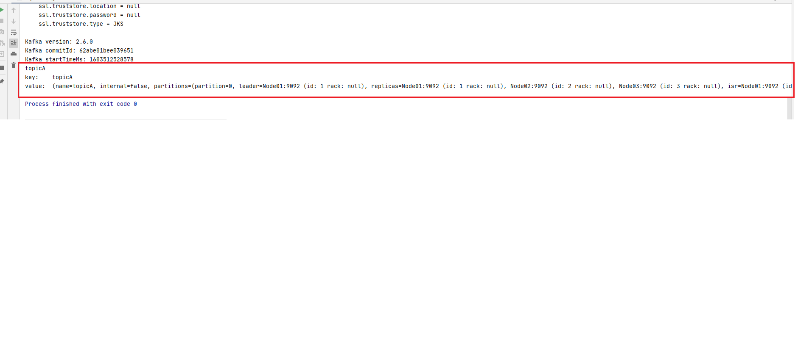

step2: 然后启动一个producer往往topicA里写入5条数据;
```java
package main.core;

import org.apache.kafka.clients.producer.KafkaProducer;
import org.apache.kafka.clients.producer.ProducerConfig;
import org.apache.kafka.clients.producer.ProducerRecord;
import org.apache.kafka.common.serialization.StringSerializer;

import java.util.Properties;

/**
 * created by Joshua.H.Brooks on 2020.10月.22.12.48
 */
public class Producer {
    public static void main(String[] args) throws InterruptedException {
         produce();
    }
    private static void produce() throws InterruptedException {
        Properties properties = new Properties();
        properties.setProperty(ProducerConfig.BOOTSTRAP_SERVERS_CONFIG, "Node01:9092,Node02:9092,Node03:9092");
        properties.setProperty(ProducerConfig.KEY_SERIALIZER_CLASS_CONFIG, StringSerializer.class.getName());
        properties.setProperty(ProducerConfig.VALUE_SERIALIZER_CLASS_CONFIG, StringSerializer.class.getName());
        // 2. 生产者创建
        KafkaProducer<String, String> producer = new KafkaProducer<>(properties);
        for (int i = 1; i <= 5; i++) {
            ProducerRecord<String, String> producerRecord = 
                    new ProducerRecord<>("topicA" ,  String.valueOf(i));
            producer.send(producerRecord);
        }
        producer.close();
    }
}
```
step3: 然后分别启动consumer1(offset配置为latest)和consumer2(offset配置为earliest)订阅topicA. **注意此时是两个消费者首次消费topicA**
conmuser1(offset设置latest):
```java
package advanced.offset;

import org.apache.kafka.clients.consumer.ConsumerConfig;
import org.apache.kafka.clients.consumer.ConsumerRecord;
import org.apache.kafka.clients.consumer.ConsumerRecords;
import org.apache.kafka.clients.consumer.KafkaConsumer;
import org.apache.kafka.common.header.Headers;
import org.apache.kafka.common.record.TimestampType;
import org.apache.kafka.common.serialization.StringDeserializer;

import java.time.Duration;
import java.util.Iterator;
import java.util.Optional;
import java.util.Properties;
import java.util.regex.Pattern;

public class ControlleredOffset1 {
    public static void main(String[] args) throws InterruptedException {
        consume();
    }

    private static void consume() {
        Properties properties = new Properties();
        properties.setProperty(
                ConsumerConfig.BOOTSTRAP_SERVERS_CONFIG, "Node01:9092,Node02:9092,Node03:9092");
        properties.setProperty(ConsumerConfig.KEY_DESERIALIZER_CLASS_CONFIG, StringDeserializer.class.getName());
        properties.setProperty(ConsumerConfig.VALUE_DESERIALIZER_CLASS_CONFIG, StringDeserializer.class.getName());
        properties.put(ConsumerConfig.GROUP_ID_CONFIG,"g1");
        //offset设置latest
        properties.setProperty(ConsumerConfig.AUTO_OFFSET_RESET_CONFIG,"latest");
        KafkaConsumer<String, String> consumer = new KafkaConsumer<String, String>(properties);
        consumer.subscribe(Pattern.compile("topicA"));
        while(true){
            ConsumerRecords<String, String> consumerRecords = consumer.poll(Duration.ofSeconds(1));
            if(!consumerRecords.isEmpty()){
                Iterator<ConsumerRecord<String, String>> iterator = consumerRecords.iterator();
                while (iterator.hasNext()){
                    ConsumerRecord<String, String> next = iterator.next();
                    String topic = next.topic();
                    int partition = next.partition();
                    String key = next.key();
                    String value = next.value(); 
                    long offset = next.offset();
                    long timestamp = next.timestamp();
                    TimestampType timestampType = next.timestampType();
                    Headers headers = next.headers();
                    Optional<Integer> leaderEpoch = next.leaderEpoch();
                    int serializedKeySize = next.serializedKeySize();
                    int serializedValueSize = next.serializedValueSize();
                    System.out.println(
                            "topic:\t"+topic+ "\t"+
                                    "key:\t"+key+"\t"+
                                    "value:\t"+value+"\t"+
                                    "offset:\t"+offset+"\t"+
                                    "partition:\t"+partition+"\t"+
                                    "timestamp:\t"+timestamp+"\t"

                    );
                }
            }
        }
    }

}
```
conmuser2 (offset设置earliest):
```java
package advanced.offset;

import org.apache.kafka.clients.consumer.ConsumerConfig;
import org.apache.kafka.clients.consumer.ConsumerRecord;
import org.apache.kafka.clients.consumer.ConsumerRecords;
import org.apache.kafka.clients.consumer.KafkaConsumer;
import org.apache.kafka.common.header.Headers;
import org.apache.kafka.common.record.TimestampType;
import org.apache.kafka.common.serialization.StringDeserializer;

import java.time.Duration;
import java.util.Iterator;
import java.util.Optional;
import java.util.Properties;
import java.util.regex.Pattern;

public class ControlleredOffset2 {
    public static void main(String[] args) throws InterruptedException {
        consume();
    }

    private static void consume() {
        Properties properties = new Properties();
        properties.setProperty(
                ConsumerConfig.BOOTSTRAP_SERVERS_CONFIG, "Node01:9092,Node02:9092,Node03:9092");
        properties.setProperty(ConsumerConfig.KEY_DESERIALIZER_CLASS_CONFIG, StringDeserializer.class.getName());
        properties.setProperty(ConsumerConfig.VALUE_DESERIALIZER_CLASS_CONFIG, StringDeserializer.class.getName());
        properties.put(ConsumerConfig.GROUP_ID_CONFIG,"g2");
        //offset设置earliest
        properties.setProperty(ConsumerConfig.AUTO_OFFSET_RESET_CONFIG,"earliest");
        KafkaConsumer<String, String> consumer = new KafkaConsumer<String, String>(properties);
        consumer.subscribe(Pattern.compile("topicA"));
        while(true){
            ConsumerRecords<String, String> consumerRecords = consumer.poll(Duration.ofSeconds(1));
            if(!consumerRecords.isEmpty()){
                Iterator<ConsumerRecord<String, String>> iterator = consumerRecords.iterator();
                while (iterator.hasNext()){
                    ConsumerRecord<String, String> next = iterator.next();
                    String topic = next.topic();
                    int partition = next.partition();
                    String key = next.key();
                    String value = next.value(); 
                    long offset = next.offset();
                    long timestamp = next.timestamp();
                    TimestampType timestampType = next.timestampType();
                    Headers headers = next.headers();
                    Optional<Integer> leaderEpoch = next.leaderEpoch();
                    int serializedKeySize = next.serializedKeySize();
                    int serializedValueSize = next.serializedValueSize();
                    System.out.println(
                            "topic:\t"+topic+ "\t"+
                                    "key:\t"+key+"\t"+
                                    "value:\t"+value+"\t"+
                                    "offset:\t"+offset+"\t"+
                                    "partition:\t"+partition+"\t"+
                                    "timestamp:\t"+timestamp+"\t"

                    );
                }
            }
        }
    }

}
```
step4: 检查consumer1和consumer2的控制台输出.<br/>
consumer1消费结果:
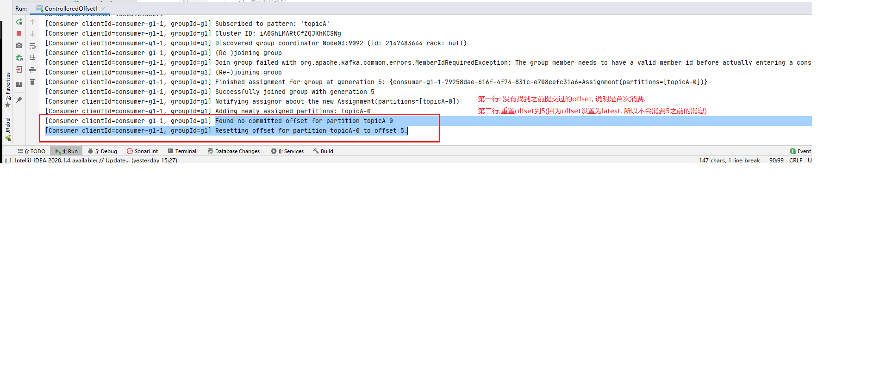
consumer2消费结果:
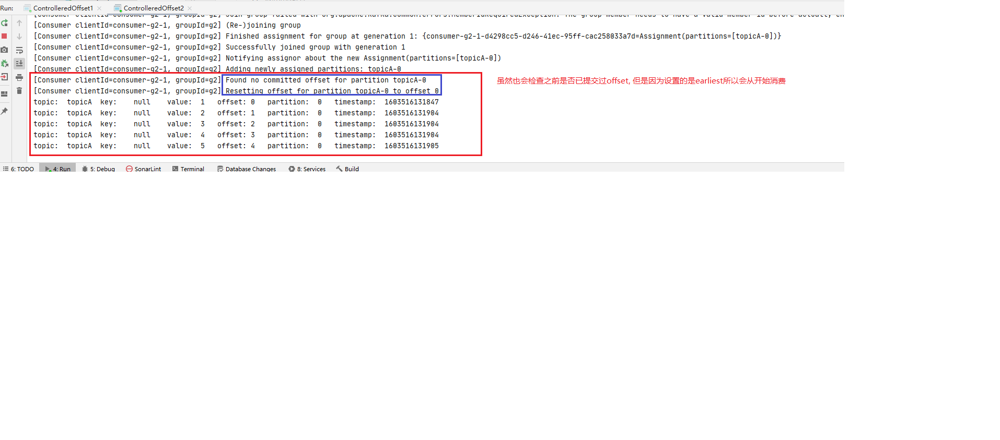


step5: 停掉consumer1和consumer2,后执行step2的代码继续往topicA里写5条数据. (注意为了方便观察, for循环里value的值改成6~10)<br/>

step6: 然后执行step3中的代码再次启动consumer1和consumer2. 观察consumer1和consumer2的控制台输出.<br/>
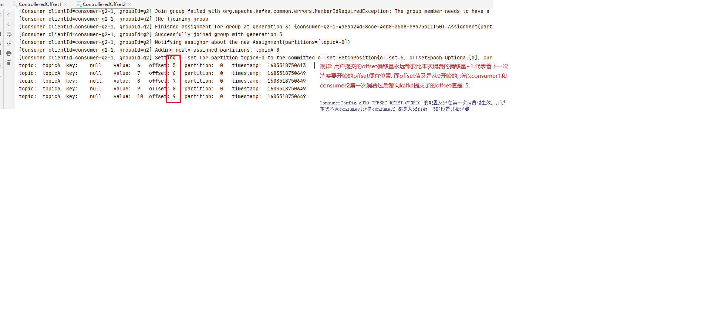
```markdown
**
规律: 用户提交的offset偏移量永远都要比本次消费的偏移量+1,代表着下一次消费要开始的offset便宜位置. 而offset值又是从0开始的, 所以consumer1和consumer2第一次消费过后都向kafka提交了的offset值是: 5.  
`ConsumerConfig.AUTO_OFFSET_RESET_CONFIG` 的配置又只在第一次消费时生效, 所以本次不管consumer1还是consumer2 第二次订阅topicA都是从offset: 5的位置开始消费.

**
```


step1 ~ step4 说明offset的配置在消费者首次订阅某主题消息时后按照指定的`ConsumerConfig.AUTO_OFFSET_RESET_CONFIG`值(latest,earliest,none)生效.<br/>
step5 ~ step6 说明`ConsumerConfig.AUTO_OFFSET_RESET_CONFIG`值**只在首次消费时生效**. </br/>

#### ConsumerConfig.ENABLE_AUTO_COMMIT_CONFIG 自动提交开启
另外可以通过下面两行设置自动提交的策略, 第一行开启, 第二行设置自动提交的时间间隔.
```java
properties.put(ConsumerConfig.ENABLE_AUTO_COMMIT_CONFIG,true);
properties.put(ConsumerConfig.AUTO_COMMIT_INTERVAL_MS_CONFIG,10000);
```
#### ConsumerConfig.ENABLE_AUTO_COMMIT_CONFIG 测试

自动提交的具体测试步骤;
step1: 新建topicB,开启生产者往topicB写5条数据 (具体可以参见ConsumerConfig.AUTO_OFFSET_RESET_CONFIG的step2和step3, 将topic名称改为topicB即可)
step2: 编写消费者consumer3, 并开启消费者上面两行自动提交的配置
**注意: 自动提交配置, 使用的是put方法, 不是setProperty方法**
```java
package advanced.offset;

import org.apache.kafka.clients.consumer.ConsumerConfig;
import org.apache.kafka.clients.consumer.ConsumerRecord;
import org.apache.kafka.clients.consumer.ConsumerRecords;
import org.apache.kafka.clients.consumer.KafkaConsumer;
import org.apache.kafka.common.header.Headers;
import org.apache.kafka.common.record.TimestampType;
import org.apache.kafka.common.serialization.StringDeserializer;

import java.time.Duration;
import java.util.Iterator;
import java.util.Optional;
import java.util.Properties;
import java.util.regex.Pattern;

/**
 * created by Joshua.H.Brooks on 2020.10月.22.09.41
 */
public class MyAutoCommitConfig {
    public static void main(String[] args) throws InterruptedException {
        consume();
    }

    private static void consume() {
        Properties properties = new Properties();
        properties.setProperty(
                ConsumerConfig.BOOTSTRAP_SERVERS_CONFIG, "Node01:9092,Node02:9092,Node03:9092");
        properties.setProperty(ConsumerConfig.KEY_DESERIALIZER_CLASS_CONFIG, StringDeserializer.class.getName());
        properties.setProperty(ConsumerConfig.VALUE_DESERIALIZER_CLASS_CONFIG, StringDeserializer.class.getName());
        //指定消费者组g3
        properties.put(ConsumerConfig.GROUP_ID_CONFIG,"g3");
        properties.setProperty(ConsumerConfig.AUTO_OFFSET_RESET_CONFIG,"earliest");
        //自动提交配置, 注意是put方法, 不是setProperty方法. 只有配置项值的类型是String的时候两者一样, 否则只能用put
        properties.put(ConsumerConfig.ENABLE_AUTO_COMMIT_CONFIG,true);
        properties.put(ConsumerConfig.AUTO_COMMIT_INTERVAL_MS_CONFIG,10000);
        KafkaConsumer<String, String> consumer = new KafkaConsumer<String, String>(properties);
        consumer.subscribe(Pattern.compile("topicB"));
        while(true){
            ConsumerRecords<String, String> consumerRecords = consumer.poll(Duration.ofSeconds(1));
            if(!consumerRecords.isEmpty()){
                Iterator<ConsumerRecord<String, String>> iterator = consumerRecords.iterator();
                while (iterator.hasNext()){
                    ConsumerRecord<String, String> next = iterator.next();
                    String topic = next.topic();//获取下一条消息
                    int partition = next.partition();//获取该消息所属分区信息
                    String key = next.key();//获取消息key
                    String value = next.value(); //获取消息的value
                    long offset = next.offset();//获取消息的偏移量
                    long timestamp = next.timestamp();//获取消息的时间戳
                    TimestampType timestampType = next.timestampType(); // 获取消息的时间戳类型
                    Headers headers = next.headers();
                    Optional<Integer> leaderEpoch = next.leaderEpoch();
                    int serializedKeySize = next.serializedKeySize();
                    int serializedValueSize = next.serializedValueSize();
                    System.out.println(
                            "topic:\t"+topic+ "\t"+
                            "key:\t"+key+"\t"+
                            "value:\t"+value+"\t"+
                            "offset:\t"+offset+"\t"+
                            "partition:\t"+partition+"\t"+
                            "timestamp:\t"+timestamp+"\t"

                    );
                }
            }
        }
    }

}

```
step3: 启动consumer3进行消费, 观察控制台结果如下. 然后尽快停掉应用(不要超过step2中设置的自动提交offset的时间间隔: 10秒)
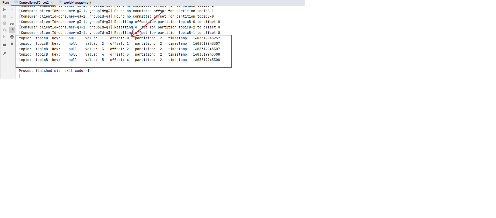

step4: 再次启动consumer3进行消费, 发现还是从最开始offset:0的位置开始消费, 这次让进城多云醒一会, 超过10秒后停掉应用.


step5: 第三次启动consumer3进行消费, 因为step4中g3消费时间超过10秒, auto_commit自动提交过offset了, 所以此次启动时不会看到从0开始消费.
 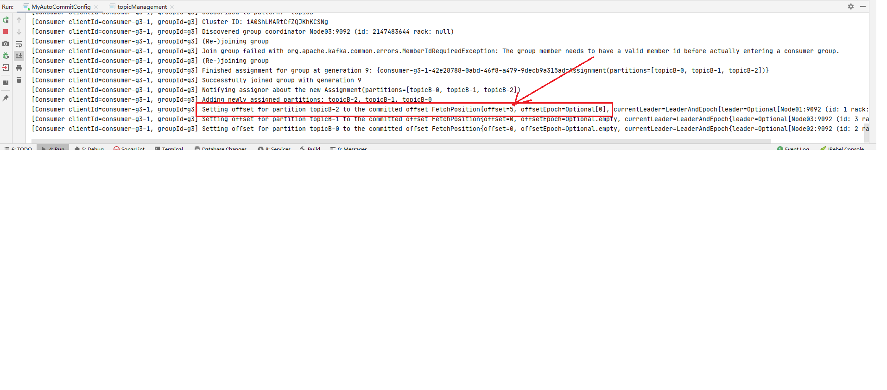


 #### ConsumerConfig.ENABLE_AUTO_COMMIT_CONFIG 自定义提交策略
 step1: 新建topicC,开启生产者往topicC写5条数据 (具体可以参见ConsumerConfig.AUTO_OFFSET_RESET_CONFIG的step2和step3, 将topic名称改为topicC即可)
 step2: 编写消费者consumer4, 并将自动提交的配置 `ConsumerConfig.ENABLE_AUTO_COMMIT_CONFIG`置为false.
 ```java

package advanced.offset;

import org.apache.kafka.clients.consumer.*;
import org.apache.kafka.common.TopicPartition;
import org.apache.kafka.common.header.Headers;
import org.apache.kafka.common.record.TimestampType;
import org.apache.kafka.common.serialization.StringDeserializer;

import java.time.Duration;
import java.util.*;
import java.util.regex.Pattern;

    public class SelfDefinedCommitStrategy {
        public static void main(String[] args) throws InterruptedException {
            consume();
        }

        private static void consume() {
            // Step 1: kafka参数配置
            Properties properties = new Properties();
            properties.setProperty(
                    ConsumerConfig.BOOTSTRAP_SERVERS_CONFIG, "Node01:9092,Node02:9092,Node03:9092");
            properties.setProperty(ConsumerConfig.KEY_DESERIALIZER_CLASS_CONFIG, StringDeserializer.class.getName());
            properties.setProperty(ConsumerConfig.VALUE_DESERIALIZER_CLASS_CONFIG, StringDeserializer.class.getName());
            properties.put(ConsumerConfig.GROUP_ID_CONFIG,"g4");
            properties.setProperty(ConsumerConfig.AUTO_OFFSET_RESET_CONFIG,"earliest");
            properties.put(ConsumerConfig.ENABLE_AUTO_COMMIT_CONFIG,false);
            // 2. 消费者创建
            KafkaConsumer<String, String> consumer = new KafkaConsumer<String, String>(properties);
            // 3. 订阅/消费 Message
            consumer.subscribe(Pattern.compile("topicC"));
            // 遍历消息队列
            while(true){
                ConsumerRecords<String, String> consumerRecords = consumer.poll(Duration.ofSeconds(1));
                if(!consumerRecords.isEmpty()){
                    Iterator<ConsumerRecord<String, String>> iterator = consumerRecords.iterator();
                    //新建一个map集合来存储分区的offset信息, key是TopicPartition, 值是offset和元数据信息
                    Map<TopicPartition, OffsetAndMetadata> offsetMap=new HashMap<>();

                    while (iterator.hasNext()){
                        ConsumerRecord<String, String> next = iterator.next();
                        String topic = next.topic();//获取下一条消息
                        int partition = next.partition();//获取该消息所属分区信息
                        String key = next.key();//获取消息key
                        String value = next.value(); //获取消息的value
                        long offset = next.offset();//获取消息的偏移量
                        long timestamp = next.timestamp();//获取消息的时间戳
                        TimestampType timestampType = next.timestampType(); // 获取消息的时间戳类型
                        Headers headers = next.headers();
                        Optional<Integer> leaderEpoch = next.leaderEpoch();
                        int serializedKeySize = next.serializedKeySize();
                        int serializedValueSize = next.serializedValueSize();
                        System.out.println(
                                "topic:\t"+topic+ "\t"+
                                        "key:\t"+key+"\t"+
                                        "value:\t"+value+"\t"+
                                        "offset:\t"+offset+"\t"+
                                        "partition:\t"+partition+"\t"+
                                        "timestamp:\t"+timestamp+"\t"

                        );
                        //每次消费完之后都要提交offset和元数据信息, 也可以格局自己的业务需求去在合适的时机提交.
                        offsetMap.put(new TopicPartition(topic,partition),new OffsetAndMetadata(offset));
                        consumer.commitAsync(offsetMap, new OffsetCommitCallback() {
                            @Override
                            public void onComplete(Map<TopicPartition, OffsetAndMetadata> offsets, Exception exception) {
                                System.out.println("提交了如下offset&metadata信息: \r\n"+"offset:\t"+offset+"\texception(if any):\t"+exception);
                            }
                        });
                    }
                }
            }
        }

    }

 ```
发现确实有提交

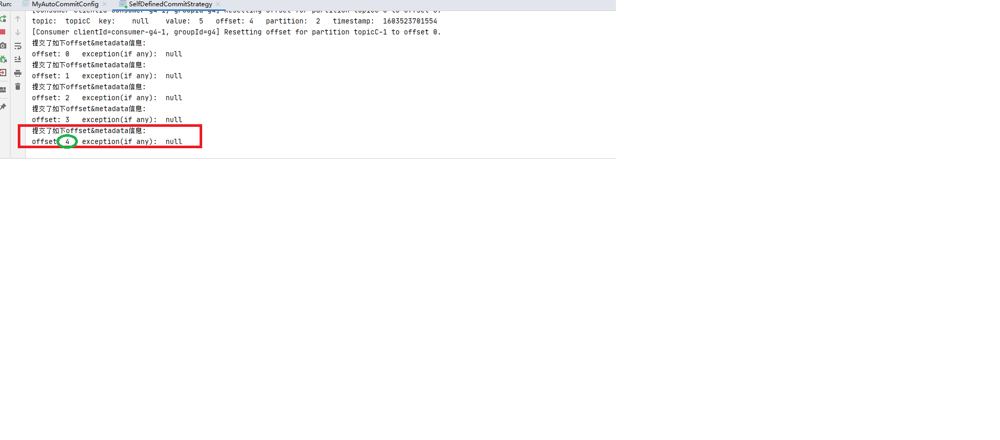

 step3: 停掉消费进城后再次重启, 还是消费者组g4,此时再观察发现又消费到了: offset:4 (如下图:)
 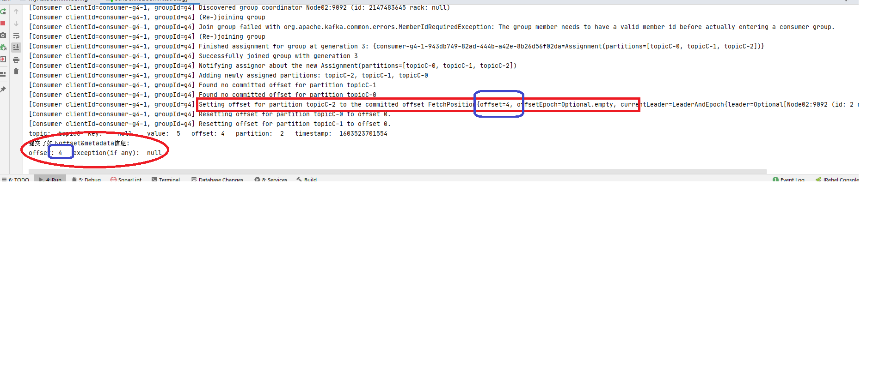
 这是为什么呢? 
 因为消费者最后一次提交的offset的数值是下一次再次消费时开始订阅的起始位置, 也就是说第一次consumer4消费完之后提交的offset值是4, 所以下一次consumer4是从offset:4开始消费的.
 所以, 回到前面提到的规律:用户提交的offset偏移量永远都要比本次消费的偏移量+1, 所以修改step3的代码(offset-->offset+1)后启动一次consumer4让他最后一次提交的offset为5:
 ```java
offsetMap.put(new TopicPartition(topic,partition),new OffsetAndMetadata(offset+1));
 ```
 step4: 再次启动consumer4消费TopicC发现此次就消费不到了.
 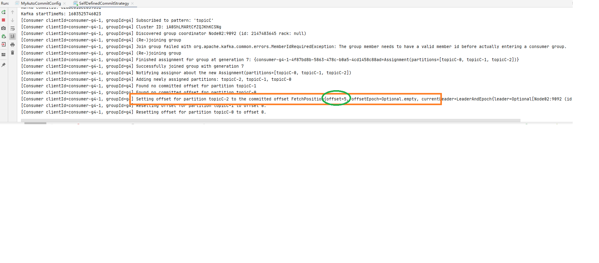

 ### 确认应答与重试机制
 #### 机制解释
 Kafka生产这在发送完一个消息后, 要求broker在规定的时间内进行Ack应答, 如果没有在规定的时间内进行应答, Kafka生产者会重试N次重新发送信息.
 而broker的确认应答机制可以有如下几种设置
 <ol>
 <li>acks=1: 此时Leader会将record写到本地日志中, 但会在不等待所有follower都确认的情况下就做出响应. 这种情况下,如果Leader在确认应答后宕机, 那么记录会丢失. 因为follower还没有进行复制记录到副本.</li>
 <li>acks=0: 此时, 生产者根本不会等待broker做出任何确认, 该记录将立即添加到网络套接字缓冲区并视为已发送.这种情况下不能保证服务端broker已接收到信息.</li>
 <li>acks=all / acks=-1: 两种写法效果一样, 都是: Leader在接收到信息后需要等待全部ISR(in-sync replicas)同步副本确认.这就保证了, 只要至少一个同步副本处于活动状态, 记录就不会丢失. 这是最有力的保证</li>
 </ol>
 如果生产者在规定时间内没有得到Leader的yingda , 可以开启retries重试机制.
 request.timeout.ms=30000 (默认30秒)
 retries=2147483647 (默认)

 具体可以参见官网文档3.3节的[acks](http://kafka.apache.org/documentation/#acks) 部分和4.8节的 [Availability and Durability Guarantees](http://kafka.apache.org/documentation/#design_ha) 部分

 #### 测试
 ste1: 启动消费者订阅topicC的消息:
 ```java
package advanced.Ack;

import org.apache.kafka.clients.consumer.ConsumerConfig;
import org.apache.kafka.clients.consumer.ConsumerRecord;
import org.apache.kafka.clients.consumer.ConsumerRecords;
import org.apache.kafka.clients.consumer.KafkaConsumer;
import org.apache.kafka.common.header.Headers;
import org.apache.kafka.common.record.TimestampType;
import org.apache.kafka.common.serialization.StringDeserializer;

import java.time.Duration;
import java.util.Iterator;
import java.util.Optional;
import java.util.Properties;
import java.util.regex.Pattern;

/**
 * created by Joshua.H.Brooks on 2020.10月.22.09.41
 */
public class AcksConsumer {
    public static void main(String[] args) throws InterruptedException {
        consume();
    }

    private static void consume() {
        // Step 1: kafka参数配置
        Properties properties = new Properties();
        properties.setProperty(
                ConsumerConfig.BOOTSTRAP_SERVERS_CONFIG, "Node01:9092,Node02:9092,Node03:9092");
        //消息接收到后要进行反序列化解析
        properties.setProperty(ConsumerConfig.KEY_DESERIALIZER_CLASS_CONFIG, StringDeserializer.class.getName());
        properties.setProperty(ConsumerConfig.VALUE_DESERIALIZER_CLASS_CONFIG, StringDeserializer.class.getName());
        //消费者要指明属于哪一个消费者组
        properties.put(ConsumerConfig.GROUP_ID_CONFIG,"g4");
        properties.setProperty(ConsumerConfig.AUTO_OFFSET_RESET_CONFIG,"latest");

        // 2. 消费者创建
        KafkaConsumer<String, String> consumer = new KafkaConsumer<String, String>(properties);
        // 3. 订阅/消费 Message
        consumer.subscribe(Pattern.compile("topicC"));
        // 遍历消息队列
        while(true){
            ConsumerRecords<String, String> consumerRecords = consumer.poll(Duration.ofSeconds(1));
            if(!consumerRecords.isEmpty()){
                Iterator<ConsumerRecord<String, String>> iterator = consumerRecords.iterator();
                while (iterator.hasNext()){
                    ConsumerRecord<String, String> next = iterator.next();
                    String topic = next.topic();//获取下一条消息
                    int partition = next.partition();//获取该消息所属分区信息
                    String key = next.key();//获取消息key
                    String value = next.value(); //获取消息的value
                    long offset = next.offset();//获取消息的偏移量
                    long timestamp = next.timestamp();//获取消息的时间戳
                    TimestampType timestampType = next.timestampType(); // 获取消息的时间戳类型
                    Headers headers = next.headers();
                    Optional<Integer> leaderEpoch = next.leaderEpoch();
                    int serializedKeySize = next.serializedKeySize();
                    int serializedValueSize = next.serializedValueSize();
                    System.out.println(
                            "topic:\t"+topic+ "\t"+
                            "key:\t"+key+"\t"+
                            "value:\t"+value+"\t"+
                            "offset:\t"+offset+"\t"+
                            "partition:\t"+partition+"\t"+
                             "timestampType:\t"+timestampType+"\t"+
                            "timestamp:\t"+timestamp+"\t"

                    );
                }
            }
        }
    }

}
 ```
 step2: 启动生产者往topicC发布消息 (**注意三行确认应答和重试机制的配置**)
 ```java
package advanced.Ack;

import org.apache.kafka.clients.producer.KafkaProducer;
import org.apache.kafka.clients.producer.ProducerConfig;
import org.apache.kafka.clients.producer.ProducerRecord;
import org.apache.kafka.common.serialization.StringSerializer;

import java.util.Properties;

/**
 * created by Joshua.H.Brooks on 2020.10月.22.12.48
 */
public class AcksProducer {
    public static void main(String[] args) throws InterruptedException {
         produce();
    }
    private static void produce() throws InterruptedException {
        Properties properties = new Properties();
        properties.setProperty(ProducerConfig.BOOTSTRAP_SERVERS_CONFIG, "Node01:9092,Node02:9092,Node03:9092");

        properties.setProperty(ProducerConfig.KEY_SERIALIZER_CLASS_CONFIG, StringSerializer.class.getName());
        properties.setProperty(ProducerConfig.VALUE_SERIALIZER_CLASS_CONFIG, StringSerializer.class.getName());
        properties.put(ProducerConfig.REQUEST_TIMEOUT_MS_CONFIG,"1"); // 设置请求超时时间为1毫秒.
        properties.put(ProducerConfig.ACKS_CONFIG,"all"); // 设置确认应答机制为all, 即需要等待所有ISR副本确认
        properties.put(ProducerConfig.RETRIES_CONFIG,3); //设置重试3次, (不包含第一次)

        KafkaProducer<String, String> producer = new KafkaProducer<>(properties);

            // 创建producerrecord
            ProducerRecord<String, String> producerRecord = new ProducerRecord<>("topicC" , "acks","ack test");
            // 发送record
            producer.send(producerRecord);
            //发送信息后刷新一下
            producer.flush();

        producer.close();
    }
}

 ```

可以看到producer的控制台的3次重试记录:
 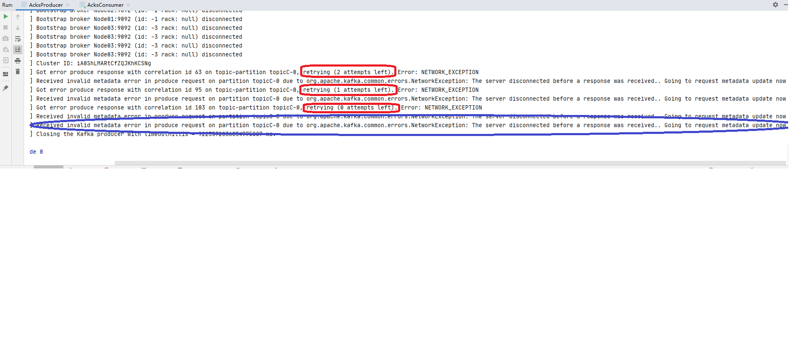
 也可以看到消费者控制台的消费记录(从生产者的代码和此处同一创建时间的消息记录有4个(初始发送和3次重试以供4次)不同offset的记录可以看出重复消费了.):
 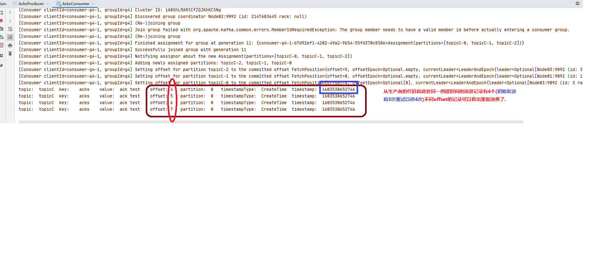

 确认应答与重试机制原理流程图参见如下:
 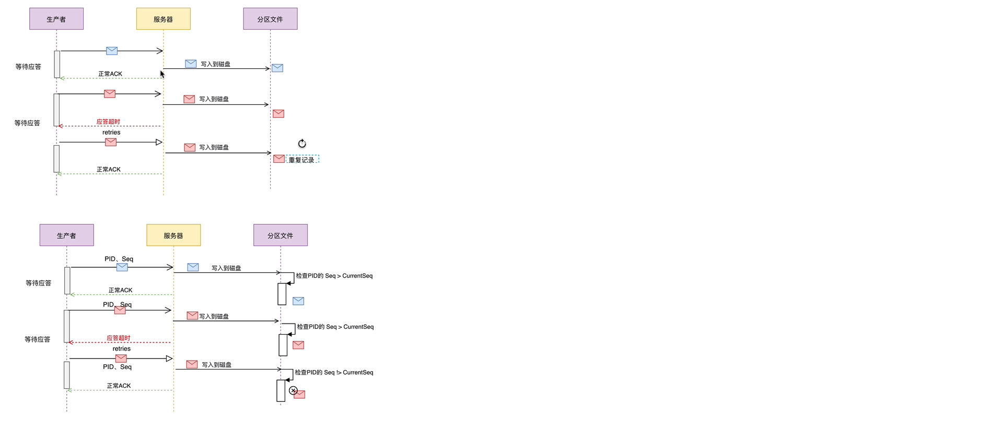
 
 
 
 ## Kafka-Eagle
 
# 配置
## 代理(Broker)配置
## 主题配置
## 生产者配置
## 消费者配置
## 连接配置
## 流配置
## 管理员客户端配置

# 设计
## 动机
## 持久化
## 高效性
## 生产者设计
## 消费者设计
## 消息发送语义
## 副本
## 日志压缩
## 定额

# 实现
##
