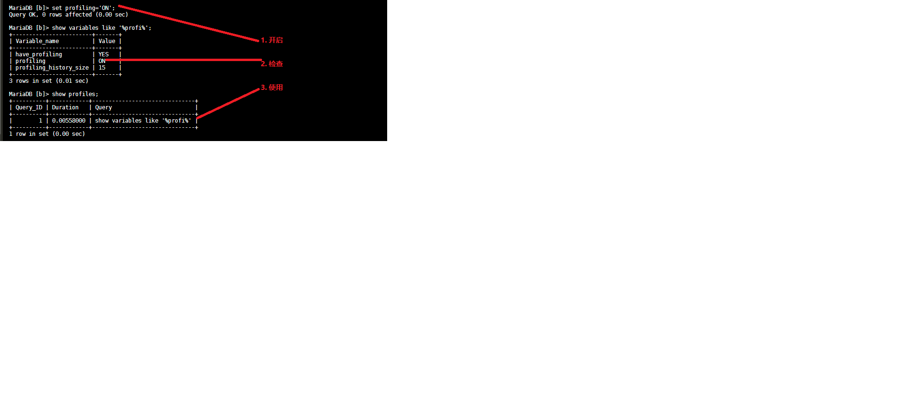
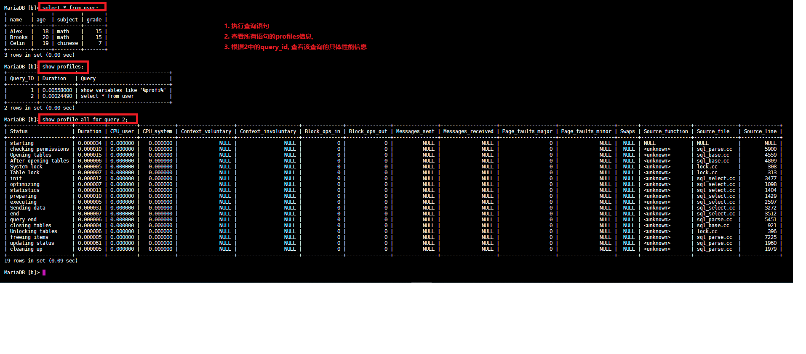

Mysql 调优

# 性能监控

## show profile (查询剖析)
要使用show profile功能, 首先确保已开启.
```mysql
show variables like '%profil%'
```
开启
```mysql
set profiling ='ON';
```



| 类型-功能 | 指令   | 截图                          |
| ---- | ---- | ----------------------------- |
| all-详细  |  show profile all for query 1;    |  |
|      |      |                               |
|      |      |                               |
|      |      |                               |
|      |      |                               |
|      |      |                               |
|      |      |                               |
|      |      |                               |


## performance schema (高级查询剖析)

## show processlist (查看连接的线程个数)

# schema与数据类型优化

## 数据类型优化

1. 
